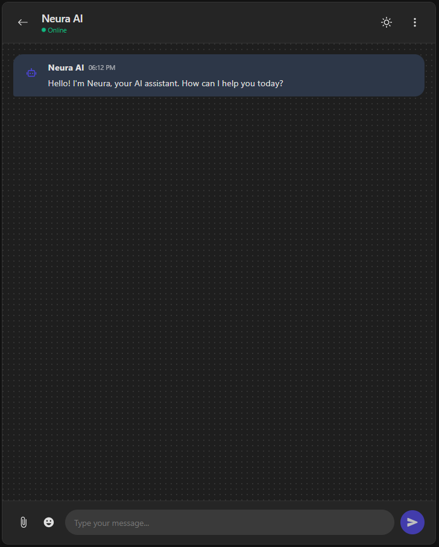

## 🧠 Neura AI Chatbot

A modern AI chatbot built with:

- **React** frontend (beautiful, responsive, dark/light mode)
- **Flask** backend using **Groq API (llama3-70b-8192)** for fast, high-quality AI responses
- Typing effect, conversation history, personality modes, and error handling

🌐 **Frontend deployed on Vercel**
⚙️ **Backend deployed on Hugging Face Spaces**

---

## ✨ Features

✅ Real-time AI chat
✅ Typing animation
✅ Dark & light mode toggle
✅ Conversation history
✅ Friendly personality
✅ Clear conversation & settings menu
✅ Responsive UI (desktop & mobile)

---

## 📦 Technologies

- React (Frontend)
- Flask (Python Backend)
- Groq API (llama3-70b-8192 model)
- Axios
- React Icons
- Hugging Face Spaces (Backend deployment)
- Vercel (Frontend deployment)

---

## 📸 Preview



## 🚀 Live Demo

<<<<<<< HEAD
- **Frontend (Vercel):** [🔗 neura-chatbot.haidersajjad.site](#)
=======
* **Frontend (Vercel):** [🔗 neura-chatbot.haidersajjad.site](#)
>>>>>>> fdcea7a46ed231182eaab9ae96a7d9c9911913ae

---

## 🛠️ Local Setup

### 1. Clone the repository

```bash
git clone https://https://github.com/HSA-ATTOCK/neura-chatbot.git
```

---

### 2. Backend (Flask)

#### 📦 Install dependencies

```bash
cd backend
python -m venv venv
source venv/bin/activate  # On Windows: venv\Scripts\activate
pip install -r requirements.txt
```

#### ⚙️ Create `.env` file

```env
GROQ_API_KEY=your_groq_api_key_here
```

#### ▶️ Run backend locally

```bash
python app.py
```

The API runs on: [http://localhost:5000](http://localhost:5000)

---

### 3. Frontend (React)

#### 📦 Install dependencies

```bash
cd frontend
npm install
```

#### 🔧 Configure API URL

Edit `src/App.js` (or use environment variable):

```javascript
const res = await axios.post("http://localhost:5000/chat", {
  message: input,
});
```

_(For production, replace with Hugging Face API URL)_

---

#### ▶️ Run frontend locally

```bash
npm start
```

The app runs on: [http://localhost:3000](http://localhost:3000)

---

## ☁️ Deploy to Hugging Face Spaces (Backend)

1. Create a new **Space** → choose **"Python"**
2. Upload your `backend/` folder (including `app.py`, `requirements.txt`, etc.)
3. In **Space settings → Variables**, add your `GROQ_API_KEY`
4. Hugging Face automatically builds and serves your Flask app

> 📌 Make sure the Flask app runs on `host='0.0.0.0', port=7860` if required by Spaces.

---

## ☁️ Deploy to Vercel (Frontend)

1. Create a new Vercel project → import `frontend/`
2. In **Vercel environment variables**, add:

```env
REACT_APP_API_URL=https://your-huggingface-space-url/chat
```

3. In your code, use:

```javascript
const apiUrl = process.env.REACT_APP_API_URL;
const res = await axios.post(`${apiUrl}`, { message: input });
```

4. Vercel builds and deploys your frontend automatically

---

## 📄 Folder Structure

```bash
neura-ai-chatbot/
├── backend/                # Flask API
│   ├── app.py
│   ├── requirements.txt
│   └── .env
└── frontend/               # React app
    ├── src/
    │   ├── App.js
    │   └── App.css
    ├── package.json
    └── ...
```

---

## 🧑‍💻 Credits

- Developed by **Haider Sajjad Azmat**
- AI model via **Groq (llama3-70b-8192)**
- Frontend deployed on **Vercel**
- Backend deployed on **Hugging Face Spaces**

---

## 📬 Contact

🌐 [haidersajjad.site](https://haidersajjad.site)
📧 Email: \[hsaattock@gmail.com]

---
